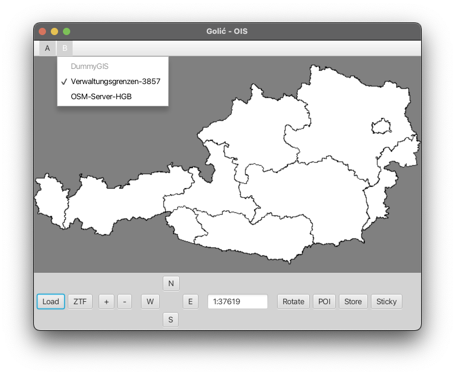
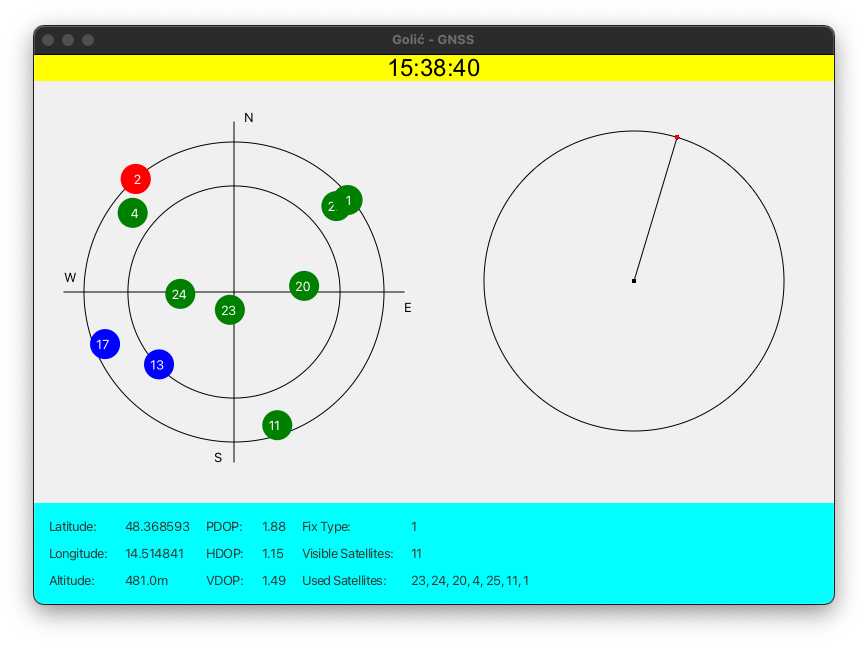

# Location-Based Information Systems

Welcome to the **OIS (Ortsbezogene Informationssysteme)** project repository! This project embodies a comprehensive exploration of location-based services through the lens of Geographic Information Systems (GIS). 
It is structured around a series of interrelated exercises, culminating in an integrated application that leverages advanced geographic data to deliver dynamic functionalities.

## Project Overview

This project is designed to delve into the complexities of geographic data management and visualization. It encompasses two primary components:

1. **MapClient**: This robust application serves as the front-end interface, facilitating user interactions with rich geographic datasets. Built using **JavaFX**, MapClient provides a sleek and responsive GUI that enhances user experience and engagement.

   - **Server Options**:
     - **Verwaltungsgrenzen-3857**: This option connects to a PostgreSQL database containing detailed administrative boundary data. Users can visualize and interact with regional information seamlessly.
     - **OSM-Server-HGB**: Tapping into OpenStreetMap data, this server option provides extensive access to geographical features, including roads, rivers, and landmarks, enriching the user's spatial awareness and data exploration capabilities.

   The MapClient is engineered to perform complex geospatial queries and data rendering in real time, making it an essential tool for users interested in geographic analysis.

2. **GNSS (Global Navigation Satellite System)**: This component offers a simulation of GNSS data processing, tailored to work with NMEA format data files—a standard used for transmitting location information from GNSS devices.

   The GNSS Simulator efficiently reads and processes GPS log files, enabling users to visualize and analyze location data dynamically. This component underscores the project’s commitment to providing actionable insights derived from geographic data.

## Technologies Used

- **JavaFX**: Leveraging this powerful framework, the project delivers an intuitive and interactive user interface that enhances user engagement and facilitates effective data visualization.
- **PostgreSQL**: This relational database management system serves as the backbone for storing and managing geographic data.
- **PostGIS**: The project integrates PostGIS, an advanced extension for PostgreSQL, which enables sophisticated geographic queries and data manipulation, making spatial data analysis feasible and efficient.
- **Docker**: By containerizing the PostgreSQL and PostGIS setup, we ensure a streamlined deployment process that simplifies configuration and scalability.

## Requirements

To successfully run this project, you must set up the following Docker containers:

- **PostgreSQL with PostGIS** for effective geographic data handling:
    - OSM Database: `jdbc:postgresql://localhost:5432/osm_hagenberg_3857`
    - Verwaltungsgrenzen Database: `jdbc:postgresql://localhost:5432/osm_verwaltungsgrenzen_3857`

### SQL Files

The SQL files required to set up the PostgreSQL databases with PostGIS are included in this repository. You can find them in the `OIS/MapClient/src/main/resources/sql` directory. These files are essential for initializing the geographic data structures needed for the project:

- `PostgreSQL-Hagenberg-3857.sql`
- `PostgreSQL-Verwaltungsgrenzen-3857.sql`

Ensure your Docker setup is configured according to these specifications to establish the necessary database connections seamlessly.

## DummyGIS

The "DummyGIS" option in the MapClient Gradle project is disabled due to sharing restrictions on the DummyServer provided by the professor. This option was originally intended to facilitate testing; however, users can still connect to:

- **Verwaltungsgrenzen-3857**
- **OSM-Server-HGB**

The integration of these options empowers users to access a wealth of geographic data for analysis and visualization.

## Screenshots

    
    
    
    
    

## License

This project is licensed under the MIT License. For detailed licensing information, please refer to the [LICENSE](LICENSE) file.